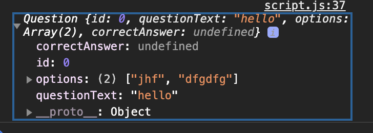
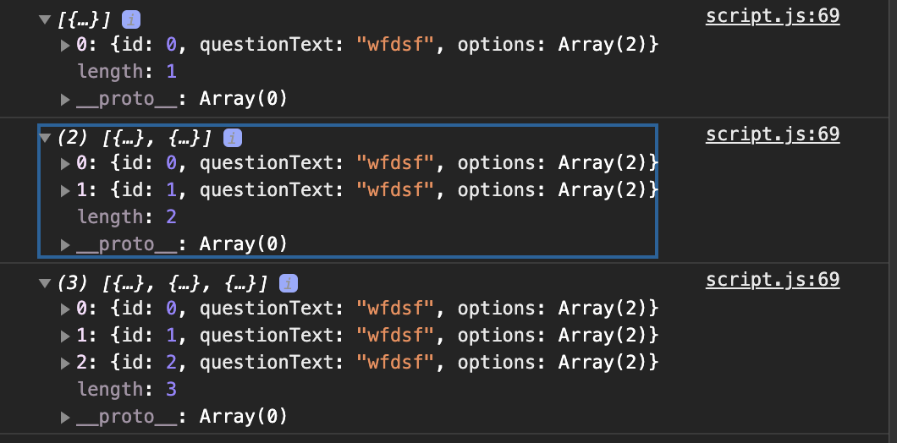

# quiz app George Lomidze

- local storage, questions are stored with local storage
- admin can edit, add and delete questions

- module pattern - IIFE - avoid naming conflicts

```javascript
// manage quiz data
const quizController = (function () {
  const private = 10;

  // PRIVATE function
  const privateFn = function (a) {
    return a + private;
  };

  // accessible from outside, because of closures we have access to private function
  // return an object
  return {
    publicMethod: function () {
      return privateFn(20);
    },
  };
  // quizController.publicMethod() 30
})();

const UIController = (function () {
  const num1 = 30;
  return {
    sum: function (num2) {
      return num1 + num2;
    },
  };
})();

// UIController will receive data from quizController, relationship between them, define parameters
const controller = (function (quizCtrl, UICtrl) {
  console.log(UIController.sum(100) + quizCtrl.publicMethod()); // 160
})(quizController, UIController);
```

## local storage

- builtin memory space in web browser
- application > local storage
- key value pairs
- set, get and remove item

```javascript
const quizController = (function () {
  // key-string, value-string
  localStorage.setItem("data", JSON.stringify([1, 2, 3, 4]));
  // removes the old key
  localStorage.setItem("data", JSON.stringify({ name: "Hulya" }));
  // remove the key, removes
  localStorage.removeItem("data");
  //  only key, gives back the value, returns as a string
  console.log(JSON.parse(localStorage.getItem("data")));
})();
```

- to keep the type of data use JSON.stringify to convert it to a string and JSON.parse

- `JSON.stringify` = Converts a JavaScript value to a JavaScript Object Notation (JSON) string.
- `JSON.parse` = Converts a JavaScript Object Notation (JSON) string into an object.
- returns an array

## function constructor

```javascript
function Question(id, questionText, options, correctAnswer) {
  this.id = id;
  this.questionText = questionText;
  this.options = options;
  this.correctAnswer = correctAnswer;
}

// create a new object using constructor
// takes the properties of parent
const newQuestion = new Question(
  questionId,
  newQuestionText.value,
  optionsArr,
  correctAnswer
);
```

bind the object to local storage



### local storage

```javascript
const questionLocalStorage = {
  setQuestionCollection: function (newCollection) {
    localStorage.setItem("questionCollection", JSON.stringify(newCollection));
  },
  getQuestionCollection: function () {
    return JSON.parse(localStorage.getItem("questionCollection"));
  },
  removeQuestionCollection: function () {
    localStorage.removeItem("questionCollection");
  },
};

// get person data from local storage
personData = personLocalStorage.getPersonData(); 
personData.push(newPerson); // add to local storage
console.log(newPerson);
personLocalStorage.setPersonData(personData); // update local storage
```

QUESTION ID - get dynamically



- add questions
- add inputs dynamically after focus pseudo class
- create questions list
- edit questions
- update questions
- delete questions

```javascript
// mouse events disable the button
domItems.questionsClearBtn.style.pointerEvents = "none";
```

- after clicking on update button, hide update and delete buttons
- display insert button back

- clear the list

```js
// clear the list of questions, confirm returns boolean, ok - true, cancel false
const confirmation = confirm();
```

- display the quiz questions from admin list to UI
- progress bar

```js
// after clicking on option disable the options wrapper
domItems.quizOptionsWrapper.style.cssText =
  "opacity : 0.6; pointer-events: none;";

// change img src attribute
domItems.emotionIcon.setAttribute("src", twoOptions.emotionType[index]);

// change the span background color
selectedAnswer.previousElementSibling.style.backgroundColor =
  twoOptions.optionsSpanBg[index];
```

`insertAdjacentHTML` adds HTML beforeend, afterbegin html element

- `logout` button surround the button with a -link text and direct to sign up page, from html only 


`parseInt(event.target.id.split('_')[1])`

- start from controller, connect UI controller to Quiz Controller
- create a method in UI controller
- invoke the function from controller
- get the local storage from quiz controller